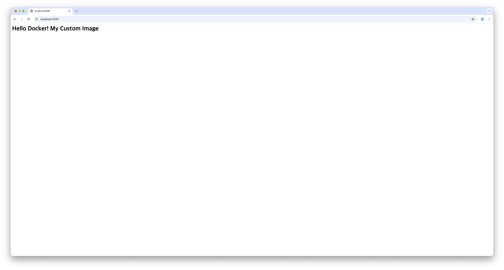

# 05. 포트 매핑

> [← 목록으로](../README.md)

---

- 앞 실습 컨테이너 정리
```bash
(사용자) docker-practice % docker rm -f custom-web
```
<br>
<br>

- 8080 포트로 실행
```bash
(사용자) docker-practice % docker run -d --name web-8080 -p 8080:80 my-nginx:1.0
```
<br>
<br>

- 8081 포트로 실행 (같은 이미지, 다른 포트)
```bash
(사용자) docker-practice % docker run -d --name web-8081 -p 8081:80 my-nginx:1.0
```
<br>
<br>

- 실행 중인 컨테이너 확인
```bash
(사용자) docker-practice % docker ps
```
<br>
<br>

- 접속 확인
```bash
(사용자) docker-practice % curl http://localhost:8080
```

```bash
(사용자) docker-practice % curl http://localhost:8081
```
<br>
<br>

- 브라우저 접속 확인

`localhost:8080`


`localhost:8081`


<br>
<br>

- 실습 컨테이너 정리
```bash
(사용자) docker-practice % docker rm -f web-8080 web-8081
```
<br>
<br>

---

> [← 목록으로](../README.md)
