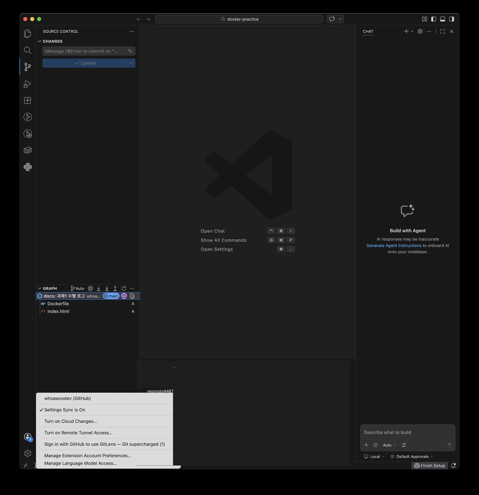
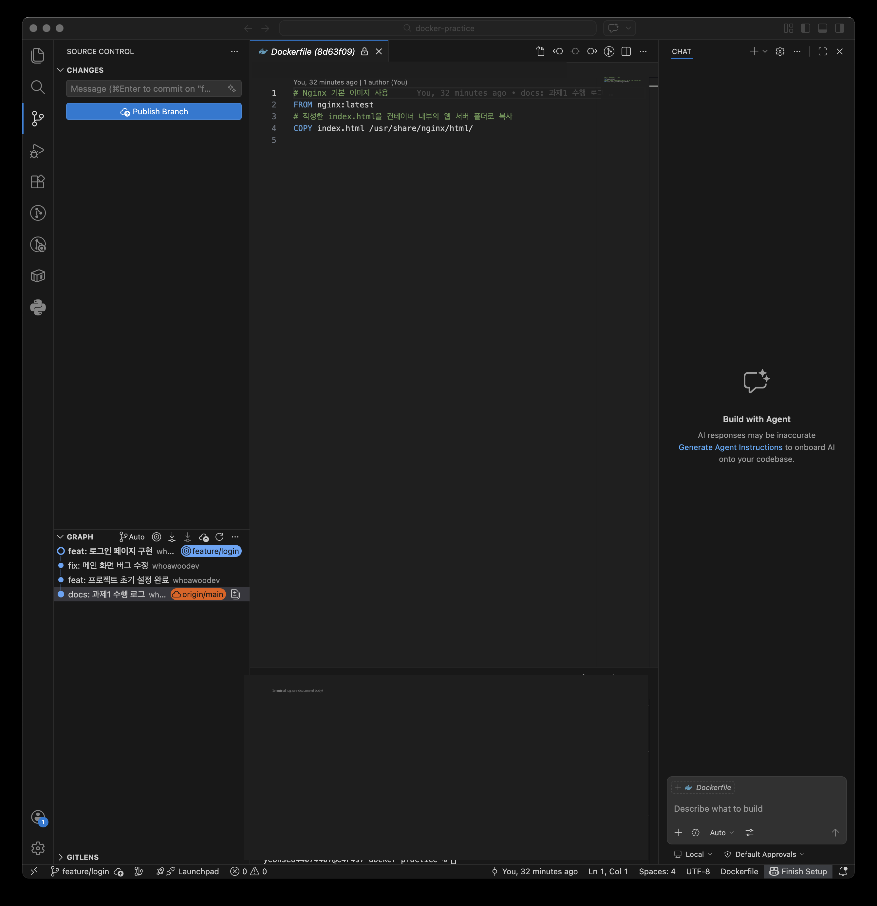

# 08. Git 설정 및 GitHub 연동

> [← 목록으로](../README.md)

---

 
- 작업 디렉토리로 이동
```bash
(사용자) ~ % cd Documents
```
<br>
<br>

- Git 사용자 정보 설정
```bash
(사용자) Documents % git config --global user.name [깃허브 이름]
```

```bash
(사용자) Documents % git config --global user.email [깃허브 이메일]
```
<br>
<br>

- 기본 브랜치 설정
```bash
(사용자) Documents % git config --global init.defaultBranch main
```
<br>
<br>

- 설정 확인
```bash
(사용자) Documents % git config --list
```

```
credential.helper=osxkeychain
user.name=[깃허브 이름]
user.email=[깃허브 이메일]
init.defaultbranch=main
```
<br>
<br>

- 커밋할 파일 준비 (04에서 만든 것과 동일)
```bash
(사용자) Documents % mkdir docker-practice && cd docker-practice
(사용자) docker-practice % cat > Dockerfile << 'EOF'
# Nginx 기본 이미지 사용
FROM nginx:latest
# 작성한 index.html을 컨테이너 내부의 웹 서버 폴더로 복사
COPY index.html /usr/share/nginx/html/
EOF
(사용자) docker-practice % echo "<h1>Hello Docker! My Custom Image</h1>" > index.html
(사용자) docker-practice % ls -la
```

```
total 16
drwxr-xr-x  4 (사용자)  (사용자)  128  8 19 18:29 .
drwx------+ 4 (사용자)  (사용자)  128  8 19 18:29 ..
-rw-r--r--  1 (사용자)  (사용자)  166  8 19 18:29 Dockerfile
-rw-r--r--  1 (사용자)  (사용자)   39  8 19 18:29 index.html
```
<br>
<br>

- 저장소 초기화
```bash
(사용자) docker-practice % git init
```

```
/Users/(사용자)/Documents/docker-practice/.git/ 안의 빈 깃 저장소를 다시 초기화했습니다
```
<br>
<br>

- GitHub 원격 저장소 연결
```bash
(사용자) docker-practice % git remote add origin [저장소 주소]
```
<br>
<br>

- 커밋
```bash
(사용자) docker-practice % git add .
```

```bash
(사용자) docker-practice % git commit -m "docs: 과제1 수행 로그"
```

```
[main (최상위-커밋) 8d63f09] docs: 과제1 수행 로그
 2 files changed, 5 insertions(+)
 create mode 100644 Dockerfile
 create mode 100644 index.html
```
<br>
<br>

- 푸시 (1차 시도 — 실패)
```bash
(사용자) docker-practice % git push -u origin main
```

```
Username for 'https://github.com': [깃허브 이름]
Password for 'https://[깃허브 이름]@github.com': 

remote: Invalid username or token. Password authentication is not supported for Git operations.
fatal: Authentication failed for '[저장소 주소]'
```

계정 비밀번호로는 인증되지 않는다. 원인과 조치는 [트러블슈팅 - 문제 1](../troubleshooting/README.md#문제-1--git-push-인증-실패-password-authentication-is-not-supported)에 정리했다.
<br>
<br>

- VSCode GitHub 로그인

VSCode 좌측 하단 계정 메뉴에서 GitHub에 로그인하면 자격 증명이 `osxkeychain`에 저장되어, 이후 터미널의 `git` 명령도 별도 토큰 입력 없이 인증된다.


<br>
<br>

- 푸시 (2차 시도 — 성공)
```bash
(사용자) docker-practice % git push -u origin main
```

```
오브젝트 나열하는 중: 4, 완료.
오브젝트 개수 세는 중: 100% (4/4), 완료.
Delta compression using up to 6 threads
오브젝트 압축하는 중: 100% (3/3), 완료.
오브젝트 쓰는 중: 100% (4/4), 475 bytes | 475.00 KiB/s, 완료.
Total 4 (delta 0), reused 0 (delta 0), pack-reused 0 (from 0)
To [저장소 주소]
 * [new branch]      main -> main
branch 'main' set up to track 'origin/main'.
```
<br>
<br>

- 저장소 연동 확인

VSCode 소스 제어 패널에서 커밋 그래프와 원격 브랜치(`origin/main`)가 연결된 것을 확인할 수 있다.


<br>
<br>

---

> [← 목록으로](../README.md)
